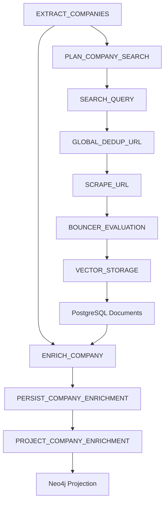

# Company Enrichment Cutover

## Purpose

This document defines how company enrichment now fits into the bespoke orchestration runtime.

It is the architecture-of-record for the cutover from:

- legacy enrichment behavior that searched, scraped, synthesized, and wrote directly to Neo4j,
- to a front-door-compliant enrichment path that reuses durable acquisition, stores its evidence in PostgreSQL and MinIO, and projects to Neo4j from Postgres-owned state.

## Current Runtime Shape

The important behavioral shift is that `ENRICH_COMPANY` is now part of the active DAG, but it does not perform source acquisition itself.

Instead:

- `EXTRACT_COMPANIES` emits enrichment work and source-planning work at the same time,
- the front-door workers acquire and store evidence through the normal acquisition chain,
- `ENRICH_COMPANY` waits until company-scoped source tasks settle,
- then enrichment synthesis reads persisted `Document` rows for that company and site.

## Phase A: Durable Enrichment Without Migrations

Phase A is already live and is intentionally migration-free.

The authoritative durable Phase A record is:

- `TaskAttempt.output_json` for `ENRICH_COMPANY`,
- plus the `company_enrichment_profile` task artifact created by the orchestrator engine.

Those artifacts store:

- `company_name`,
- `stage_estimate`,
- `venture_scale_score`,
- `primary_sector`,
- `source_urls`,
- `source_document_ids`,
- `document_count`,
- `founder_count`,
- and the full `company_profile` payload.

This gives the system an immediately replayable and inspectable enrichment record even before normalized tables are available.

### Phase A Read Surface

The Phase A inspection endpoint is:

- `GET /api/v1/pipelines/{site_id}/enrichment-artifacts`

It returns the most recent artifact-backed dossier per company from Postgres-backed orchestration state.

## Phase B: Front-Door-Compliant Enrichment Acquisition

Phase B is also now represented in the runtime.

The legacy side-channel search-and-scrape path has been replaced by reuse of the main acquisition chain:

- `PLAN_COMPANY_SEARCH`
- `SEARCH_QUERY`
- `GLOBAL_DEDUP_URL`
- `SCRAPE_URL`
- `BOUNCER_EVALUATION`
- `VECTOR_STORAGE`

The runtime now carries company lineage through that path so enrichment evidence remains attributable to a specific company and site.

In practice this means:

- vectorized documents are tagged with company metadata,
- same-site cache hits are updated to retain company lineage,
- enrichment evidence selection works over stored Postgres documents,
- and direct snippets are no longer treated as final durable evidence.

## Phase C: Normalized Enrichment Tables And Projection

Phase C is implemented in code, with rollout gated by migration timing.

The normalized relational layer consists of:

- `company_enrichment_profiles`
- `company_enrichment_founders`

The initial schema intentionally keeps flexible structures in JSONB while normalizing the main company row and child founder rows.

The persistence and projection stages are:

- `PERSIST_COMPANY_ENRICHMENT`
- `PROJECT_COMPANY_ENRICHMENT`

These stages convert synthesis output into Postgres-owned records and then project those records into Neo4j.

### Normalized Model And Migration Surface

The runtime shape for Phase C is defined in:

- `src/orchestrator/core/enrichment_models.py`
- `src/orchestrator/workers/enrichment_persistence.py`
- `alembic/versions/3f2e4a1c9b70_add_normalized_company_enrichment_tables.py`

### Phase C Read Surface

The normalized read endpoint is:

- `GET /api/v1/pipelines/{site_id}/enrichments`

When the normalized tables are present, this endpoint returns company profiles plus founder rows from Postgres-owned relational state.

## Neo4j Ownership Rule

Neo4j is no longer intended to be the only copy of enrichment truth.

The target steady state is:

- PostgreSQL owns enrichment records,
- Neo4j receives projected copies,
- and replay/backfill behavior can rebuild enrichment from durable evidence and normalized records.

## Operational Rollout Notes

- Phase A artifacts are safe to use immediately because they do not require a migration.
- Phase B is the architectural cutover point where enrichment becomes front-door compliant.
- Phase C is implemented but should only become active after the normalized-table migration is applied in an operationally safe window.
- Until those tables exist, `PERSIST_COMPANY_ENRICHMENT` skips cleanly and Phase A artifacts remain the authoritative enrichment record.

## Definition Of Done

The enrichment cutover is fully complete only when all of the following are true:

- company enrichment always acquires evidence through the same front door as the rest of ingestion,
- enrichment synthesis operates only on persisted evidence,
- company dossiers and founders are queryable from normalized PostgreSQL tables,
- Neo4j is a projection target rather than the only durable copy,
- and replay/backfill paths can recover both graph and enrichment outputs from the same durable relational source of truth.
