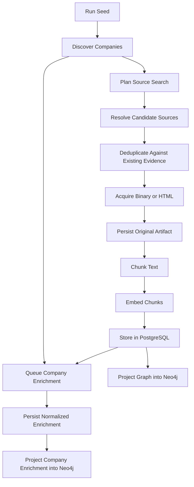

# Front-Door Ingestion

## Rule

All meaningful acquisition must enter through the same ingestion front door.

That includes:

- new site creation,
- startup discovery,
- early-stage enrichment,
- source recovery,
- backfills,
- selective replays,
- and future data recovery jobs.

## Why This Exists

The platform breaks when one path:

- inserts companies directly into Neo4j,
- another path stores text in Postgres,
- and a third path preserves binaries in MinIO.

That fragmentation makes provenance incomplete and replay impossible.

## Required Flow

## Current Branch Status

On this branch, the front door is now real for both graph generation and company enrichment:

- discovery, search, source acquisition, artifact preservation, chunking, and embedding persistence run through the bespoke orchestrator,
- `EXTRACT_COMPANIES` emits both `PLAN_COMPANY_SEARCH` and `ENRICH_COMPANY`,
- company enrichment now waits for front-door source tasks to settle and synthesizes dossiers from stored PostgreSQL documents rather than direct side-channel fetches,
- graph generation can be launched as a bespoke run over that same durable document corpus,
- canonical entities, documents, mentions, canonical relationships, community overlays, and company enrichment projections all treat PostgreSQL as system-of-record state,
- and backfills are expected to enter through that same path.

The remaining operational gap is not front-door compliance. It is rollout timing:

- Phase A enrichment durability is already live through `TaskAttempt.output_json` and `company_enrichment_profile` artifacts.
- Phase C normalized enrichment tables and the Postgres-to-Neo4j projection path are implemented, but should only become live after the corresponding migration is applied in a safe window.
- Graph-specific remaining cutover work is tracked in `docs/architecture/graph-projection-migration.md`.
- Enrichment-specific runtime shape and rollout notes are tracked in `docs/architecture/company-enrichment-cutover.md`.

## Hard Consequences

- A backfill script that only enriches a company and writes to Neo4j is not a valid ingestion path.
- Search snippets are not durable ingestion artifacts.
- Company enrichment cannot treat ad hoc Serper or Jina responses as final evidence if that evidence never enters PostgreSQL and MinIO through the front door.
- Neo4j is a projection target, not the only durable copy of enrichment truth.
- “Recovery” scripts should seed durable work into the orchestrator, not reproduce a second ingestion system.

## Existing-Site Backfills

Backfills must be modeled as new runs against existing site IDs. The front door remains the same:

1. create a new run,
2. seed the run with a replay or expansion objective,
3. let the acquisition engine perform discovery and source capture,
4. preserve the source trail,
5. rebuild graph and enrichment views idempotently from durable state.

This ensures old sites and new sites converge on one operating model.
