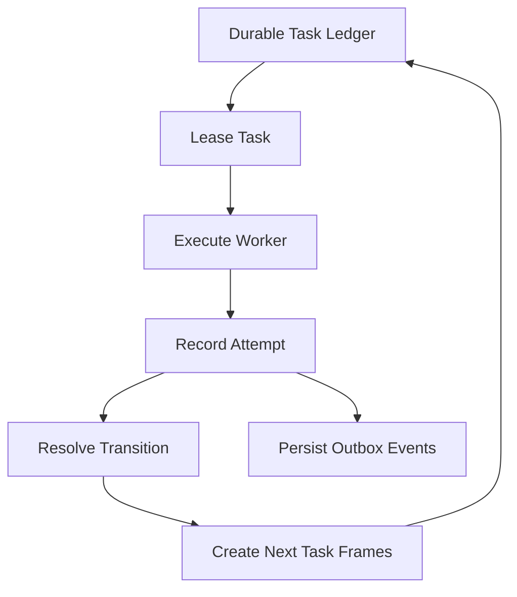

# Orchestrator Kernel

## Purpose

The bespoke orchestration kernel exists to replace implicit, in-memory, happy-path workflow behavior with durable and observable execution.

## Required Primitives

The kernel architecture must include at least:

- `pipeline_run`
  A durable record of a site-specific execution.
- `workflow_context`
  Stable run-scoped context that tasks can reference without forcing every field through every payload.
- `task_frame`
  A durable unit of work with typed payload and explicit lifecycle state.
- `task_attempt`
  A record of each lease/acquire/execute/fail cycle.
- `task_artifact`
  Durable pointers to outputs, source references, and side-effect objects.
- `outbox_event`
  Durable event stream records for UI and projection updates.
- `dead_letter_task`
  A final resting place for poisoned or exhausted work.

## Required Guarantees

### Durability

The system of record for orchestration must survive process restarts.

### Leases and heartbeats

Long-running tasks must support lease ownership and heartbeat renewal so abandoned work can be reclaimed.

### Idempotency

Workers must be written with explicit idempotency boundaries for:

- source acquisition,
- artifact persistence,
- chunk storage,
- vector writes,
- and graph projections.

Persistence keys such as `idempotency_key`, `dedupe_key`, `partition_key`, and
artifact keys must be stable and bounded. If the natural source value is an
unbounded URL or query string, keep that raw value in payload or artifact JSON
and persist a stable fingerprint in the fixed-width key column instead.

### Replay

An operator must be able to replay a task or run without inventing a one-off recovery path.

## Unacceptable End-State Behaviors

The following are explicitly disallowed as the target design:

- in-memory-only queues,
- transition logic encoded only in imperative `if` chains,
- placeholder fan-out paths with missing intermediate workers,
- worker output that is not durably attributable,
- and direct graph-only insertion bypasses.

## Execution Model

## Current Repo Status

Code under `src/orchestrator/` is now the active acquisition runtime on this branch, not only an exploratory skeleton.

### Implemented branch behavior

- Durable `pipeline_run`, `workflow_context`, `task_frame`, `task_attempt`, `task_artifact`, `outbox_event`, and `dead_letter_task` records exist.
- The transition model currently drives bespoke acquisition and the bespoke graph path through document selection, extraction barriers, canonical resolution, relationship aggregation, semantic similarity, community projection, pruning, and ready publication.
- The kernel also owns a first-class `graph` objective with document selection, extraction barriers, canonical resolution, relationship aggregation, semantic similarity, community projection, pruning, and graph-ready publication stages.
- The engine leases by concurrency class, applies task priorities, and persists terminal outcomes and emitted follow-on work.
- Acquisition-side artifacts, text storage, and bespoke graph progress/ready events now flow through this kernel instead of bypass scripts.

### Known gaps against the target end state

- Some graph-view surfaces still reflect legacy-era assumptions beyond the bespoke-owned canonical/document/relationship/community layers.
- Full parity and cutover verification against legacy graph behavior are still outstanding.

Treat the current kernel as acquisition-complete but migration-incomplete until the remaining parity, UI, and cutover work in `docs/architecture/graph-projection-migration.md` is completed.
