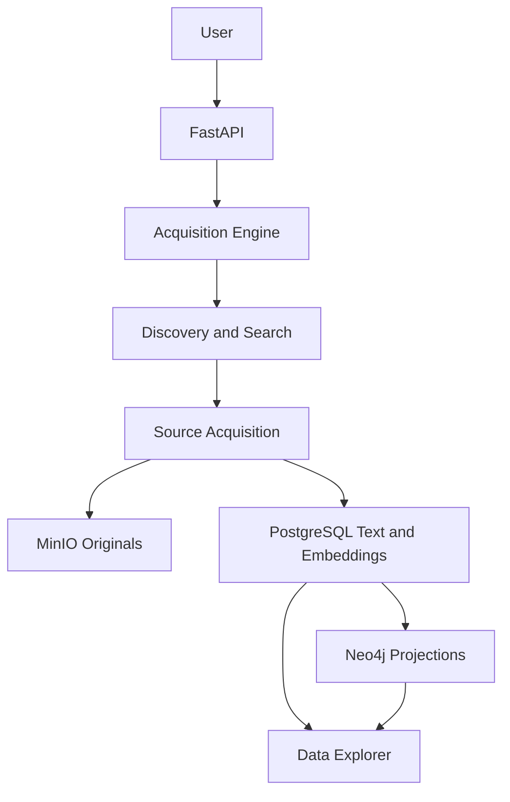

# System Overview

## Purpose

The system ingests web and file-based market evidence, preserves the primary artifacts, derives chunk-level semantic state, and projects navigable knowledge into graph and UI views.

## Major Subsystems

- **FastAPI backend**
  Entry point for pipeline creation, acquisition, viewing, and graph exploration.
- **Acquisition engine**
  The bespoke orchestration kernel under `src/orchestrator/` now owns the active acquisition and graph path on this branch, while legacy code under `src/agents/` remains in the repo during migration cutover.
- **PostgreSQL**
  Durable system of record for relational state, the orchestration ledger, document text, chunk embeddings, and durable graph facts plus canonical graph state.
- **Neo4j**
  Graph projection layer for canonical entities, relationships, documents, semantic similarity edges, communities, and exploration views.
- **MinIO**
  Original artifact store for PDFs, DOCX, PPTX, spreadsheets, and HTML snapshots.
- **Frontend**
  Dashboard, data explorer, graph views, and document/source inspection.

## Current Architectural Split

There are two orchestration worlds in the repo:

1. **Legacy runtime**
   The LangGraph/LangChain implementation under `src/agents/`.
2. **Bespoke runtime**
   The orchestration kernel under `src/orchestrator/`, which now powers the active acquisition path and the current bespoke graph generation path on this branch.

The bespoke runtime is not considered fully cut over merely because it is active on the branch. It becomes the architecture of record only when it satisfies the documentation, parity, and cutover constraints in `docs/architecture/migration-governance.md`.

## End-to-End Model

## Architectural Rules

- The engine may discover companies or sources in stages, but durable source acquisition is required before that evidence is considered fully ingested.
- Postgres and MinIO hold primary acquisition state; Neo4j is downstream of that state.
- UI views should be treated as projections over durable storage, not as proof that ingestion was sufficient.
